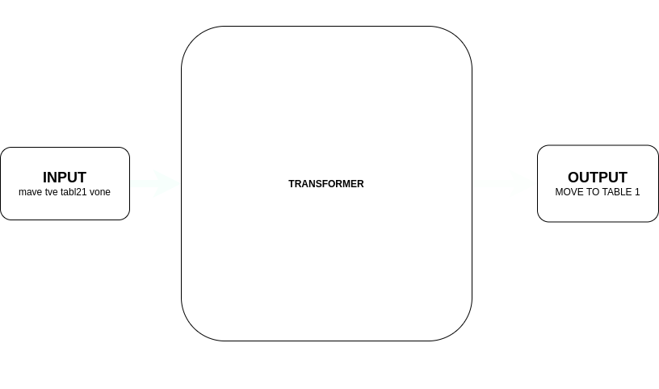

# ServeSpeak-The-Voice-Powered-Table-Attendant
"ServeSpeak: The Voice-Powered Table Attendant" is a groundbreaking project integrating robotics and AI. It effortlessly converts voice commands to text and autonomously navigates the restaurant to serve customers. With precise speech recognition and advanced navigation capabilities, ServeSpeak enhances the dining experience.

